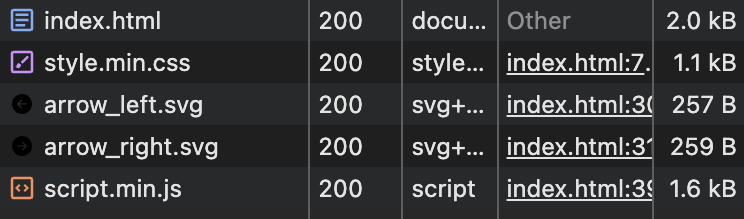

# <ins>Простой</ins> и <ins>легковесный</ins> слайдер изображений <ins>с автопрокруткой</ins>

###### vanilla css & js

<picture></picture>

<!-- Разграничитель -->
  <picture>
    <source media="(prefers-color-scheme: dark)" srcset="https://user-images.githubusercontent.com/84059957/215088292-cf50a16b-422b-43cc-a211-c4169553ca62.png">
    <source media="(prefers-color-scheme: light)" srcset="https://user-images.githubusercontent.com/84059957/210322548-b635bad5-c53d-4209-a73e-fb0adcc437bf.png">
    
  </picture>

  Вес всех файлов после минификаций:

  <picture></picture>

<!-- Окончание -->
<picture>
    <source media="(prefers-color-scheme: dark)" srcset="https://user-images.githubusercontent.com/84059957/215088776-b06bbe95-42fd-4d78-bcae-70cdbeebbbd3.png">
    <source media="(prefers-color-scheme: light)" srcset="https://user-images.githubusercontent.com/84059957/210319906-4f1e79cb-1a45-4e5c-93e9-ae21e197e0b9.png">
    
  </picture>

# Суть

Принцип довольно прост: на каждый созданный в html слайд создаётся свой `input[type=radio]` и появляется декоративный radio (label). Ну а само переключение довольно примитивное.

# Поменять цвет

Можно, поменять на светлую тему если убрать `filter:invert()` или регулировать через цвета `#000`.

---

###### js uglified via https://www.uglifyjs.net/
 
###### css minified via https://www.uglifycss.com/